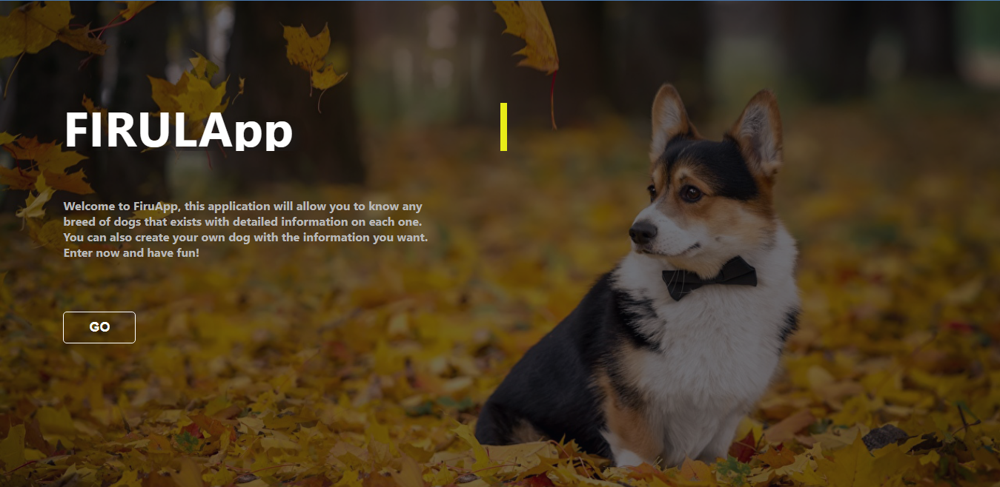
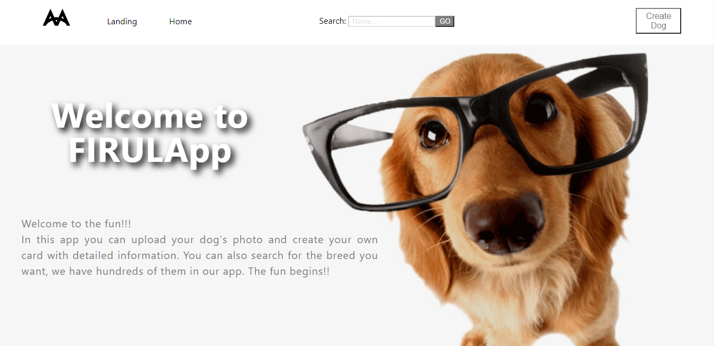
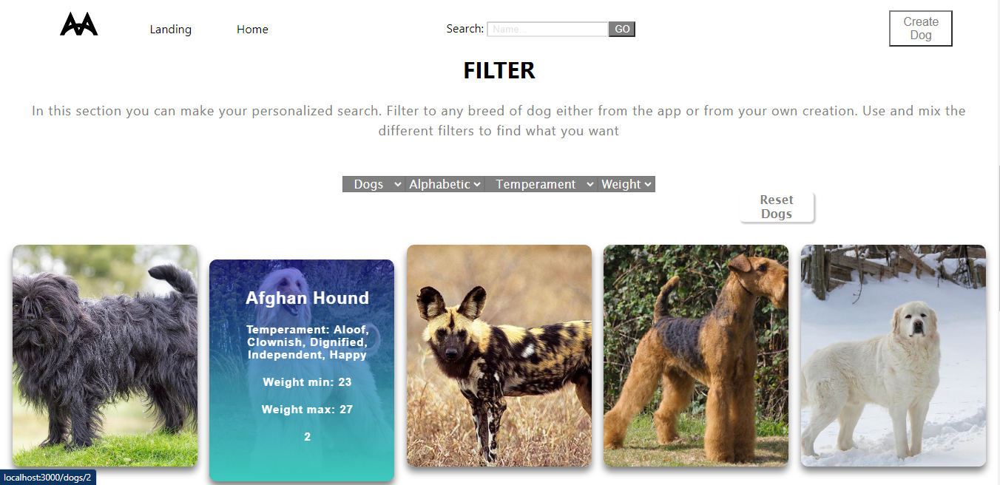
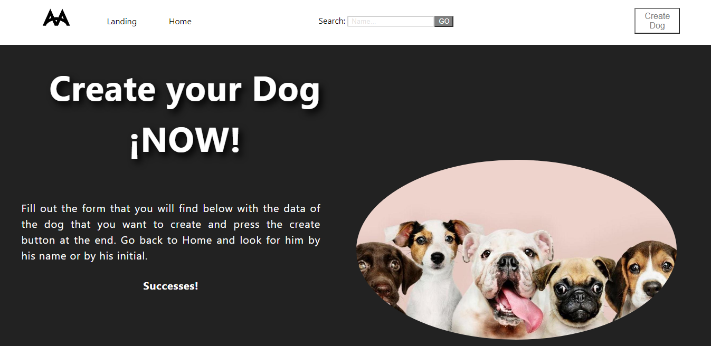
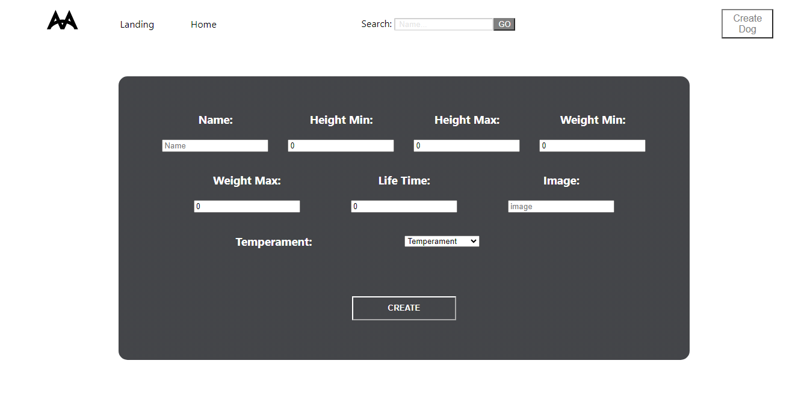

# FIRULAPP (BACK-FRONT)

## Tecnologías Utilizadas

+ Node.js     
+ Express  
+ PostgrSQL 
+ Sequelize
+ JavaScript
+ React
+ HTML
+ CSS
+ Redux
+ React-Redux
+ Bootstrap
+ MUI

## Descripción

Esta es una aplicación que está conectada a una REST API, la cual contiene información detallada de caninos. De ella se puede obtener: razas, temperamento, peso y tiempo de vida de cada uno. 

Este sitio permite realizar búsquedas especificas mediante filtros alfabéticos de la A a la Z y viceversa. También permite crear un canino con la respectiva información y subir una imagen. Este se guardará en nuestra base de datos creada a través de PostgreSQL. 

## Como se ve FirulApp

+ ### Landing Page

+ ### Home

+ ### Filtros

+ ### Creación

